# 🏗️ Architecture: Telegram Bot to Google Cloud Run Integration

This document explains the complete architecture of the Teacher Website system, focusing on how the Telegram bot integrates with Google Cloud Run to provide a phone-first content management system.

---

## 📑 Table of Contents

- [System Architecture Diagram](#-system-architecture-diagram) - Visual overview of all components
- [Data Flow: PDF Upload Process](#-data-flow-pdf-upload-process) - Step-by-step sequence
- [Telegram + Cloud Run Integration Details](#-telegram--cloud-run-integration-details) - In-depth integration guide
  - [Webhook Configuration](#1-webhook-configuration)
  - [Cloud Function Deployment](#2-cloud-function-deployment)
  - [Authentication & Authorization](#3-authentication--authorization)
  - [Cloud Storage Integration](#4-cloud-storage-integration)
  - [Conversation State Management](#5-conversation-state-management)
  - [Next.js on Cloud Run](#6-nextjs-on-cloud-run)
  - [Real-time Notifications](#7-real-time-notifications)
- [Repository Structure](#-repository-structure) - File organization
- [Security Features](#-security-features) - Security implementation
- [Deployment Flow](#-deployment-flow) - CI/CD pipeline
- [Monitoring & Metrics](#-monitoring--metrics) - Observability
- [Key Design Decisions](#-key-design-decisions) - Architecture rationale
- [Configuration](#-configuration) - Environment setup
- [Troubleshooting](#-troubleshooting) - Common issues
- [Learning Resources](#-learning-resources) - External documentation
- [Future Enhancements](#-future-enhancements) - Roadmap

---

## 📊 System Architecture Diagram

```mermaid
flowchart TB
    subgraph "User Layer"
        Teacher["👤 Teacher<br/>(Telegram User)"]
        Visitor["🌐 Website Visitor"]
    end

    subgraph "Telegram Platform"
        TelegramAPI["📱 Telegram API<br/>(Bot Platform)"]
    end

    subgraph "Google Cloud Platform"
        subgraph "Cloud Functions"
            BotFunction["☁️ Cloud Function<br/>telegram-showcase-bot<br/>(Node.js 20)"]
        end

        subgraph "Cloud Run"
            NextJSApp["🚀 Cloud Run Service<br/>showcase-app<br/>(Next.js 14 + TypeScript)"]
        end

        subgraph "Storage Layer"
            Firestore["🗄️ Firestore<br/>(NoSQL Database)<br/>- showcase collection<br/>- authorized_users<br/>- rate_limits<br/>- metrics"]
            PDFBucket["📦 Cloud Storage<br/>PDFs Bucket<br/>(Private)"]
            ThumbnailBucket["🖼️ Cloud Storage<br/>Thumbnails Bucket<br/>(Public)"]
            SecretManager["🔐 Secret Manager<br/>- Bot Token<br/>- Gemini API Key"]
        end

        subgraph "CI/CD"
            CloudBuild["⚙️ Cloud Build<br/>(Automated Deployment)"]
        end
    end

    %% User Interactions
    Teacher -->|"1. Send PDF/Commands"| TelegramAPI
    Visitor -->|"Browse Content"| NextJSApp
    Visitor -->|"Submit Contact Form"| NextJSApp

    %% Telegram Integration
    TelegramAPI -->|"2. Webhook POST"| BotFunction
    BotFunction -->|"3. Send Messages"| TelegramAPI
    TelegramAPI -->|"4. Deliver to User"| Teacher

    %% Bot Data Flow
    BotFunction -->|"Read/Write Content"| Firestore
    BotFunction -->|"Upload PDFs"| PDFBucket
    BotFunction -->|"Upload Thumbnails"| ThumbnailBucket
    BotFunction -->|"Fetch Secrets"| SecretManager

    %% Website Data Flow
    NextJSApp -->|"Read Content"| Firestore
    NextJSApp -->|"Serve Thumbnails"| ThumbnailBucket
    NextJSApp -->|"Generate Signed URLs"| PDFBucket
    NextJSApp -->|"Notify Admin"| TelegramAPI

    %% Deployment Flow
    CloudBuild -->|"Build & Deploy"| NextJSApp
    CloudBuild -->|"Deploy Function"| BotFunction

    style Teacher fill:#e1f5ff
    style Visitor fill:#fff4e1
    style BotFunction fill:#c8e6c9
    style NextJSApp fill:#ffccbc
    style Firestore fill:#f3e5f5
    style PDFBucket fill:#ffe0b2
    style ThumbnailBucket fill:#ffe0b2
    style SecretManager fill:#ffcdd2
    style CloudBuild fill:#e0e0e0
```



---

## 🔄 Data Flow: PDF Upload Process


---

## 🔌 Telegram + Cloud Run Integration Details

### 📸 Bot Interface Screenshots

The following screenshots show the actual bot interface in use:


*Bot commands, role information, and PDF upload workflow demonstration*


*Thumbnail upload process with real-time status updates*

### 1. **Webhook Configuration**

The Telegram bot operates via webhook instead of polling, making it efficient and serverless-friendly:

#### **Setup Process:**
```bash
# Webhook URL format
https://REGION-PROJECT_ID.cloudfunctions.net/telegram-showcase-bot

# Setup via Telegram API
curl -X POST "https://api.telegram.org/bot${TELEGRAM_BOT_TOKEN}/setWebhook" \
  -d "url=https://us-central1-project-id.cloudfunctions.net/telegram-showcase-bot"
```

#### **Why Webhook?**
- ✅ **Serverless-friendly**: No need for constant polling
- ✅ **Cost-effective**: Function only runs when messages arrive
- ✅ **Real-time**: Instant response to user actions
- ✅ **Scalable**: GCP handles traffic spikes automatically

### 2. **Cloud Function Deployment**

The bot is deployed as a Cloud Function with these specifications:

```yaml
# Deployment Configuration (from deploy.sh)
Runtime: Node.js 20 (LTS)
Memory: 512MB
Timeout: 540s (9 minutes)
Region: us-central1
Trigger: HTTP (webhook)
Environment Variables:
  - GOOGLE_CLOUD_PROJECT
  - BUCKET_PDFS
  - BUCKET_THUMBNAILS
  - ADMIN_USER_ID
  - CONTENT_MANAGER_USER_ID
```

#### **Function Entry Point:**
```javascript
exports.telegramShowcaseBot = async (req, res) => {
  // 1. Initialize bot if not already done
  if (!bot) {
    await initializeSecrets();
  }

  // 2. Parse Telegram webhook payload
  const update = req.body;

  // 3. Route message to appropriate handler
  if (update.message) {
    // Handle text, documents, photos, etc.
  }

  // 4. Return 200 OK immediately
  res.status(200).send('OK');
};
```

### 3. **Authentication & Authorization**

#### **Multi-Layer Security:**

```mermaid
flowchart LR
    Request["Incoming Request"] --> WebhookVerify["Webhook Verification"]
    WebhookVerify --> UserAuth["User Authorization Check"]
    UserAuth --> RateLimit["Rate Limiting"]
    RateLimit --> Process["Process Message"]
    
    UserAuth -->|"Unauthorized"| Reject["❌ Reject"]
    RateLimit -->|"Exceeded"| Reject
```



#### **Authorization System:**
```javascript
// User roles stored in Firestore and cached in memory
const AUTHORIZED_USERS = {
  [ADMIN_USER_ID]: 'admin',
  [CONTENT_MANAGER_USER_ID]: 'content_manager'
};

// Get user's role
function getUserRole(userId) {
  return AUTHORIZED_USERS[userId.toString()] || null;
}

// Check if user has specific permission (role hierarchy)
function hasPermission(userId, requiredRole) {
  const userRole = getUserRole(userId);
  if (!userRole) return false;
  
  const roleLevels = {
    'content_manager': 1,
    'admin': 2
  };
  return roleLevels[userRole] >= roleLevels[requiredRole];
}
```

#### **Rate Limiting:**
- **PDF Uploads**: 5 per hour per user
- **Thumbnail Uploads**: 10 per hour per user
- **Stored in Firestore**: Durable across function instances
- **Fail-open strategy**: Allows requests if rate limiter fails
- See [Monitoring & Metrics](#-monitoring--metrics) for tracking rate limit hits

### 4. **Cloud Storage Integration**

#### **Dual-Bucket Strategy:**

| Bucket | Access | Purpose | URL Type |
|--------|--------|---------|----------|
| **PDFs Bucket** | Private | Student work documents | Signed URLs (24h expiry) |
| **Thumbnails Bucket** | Public | Preview images | Direct HTTPS URLs |

#### **Why This Design?**
- ✅ **Privacy**: PDF content is protected (see [Security Features](#-security-features))
- ✅ **Performance**: Thumbnails load fast (no auth)
- ✅ **Cost**: Signed URLs avoid function overhead
- ✅ **Security**: Time-limited access to sensitive content

#### **Signed URL Generation:**
```javascript
// Generate 24-hour access URL
const [url] = await file.getSignedUrl({
  version: 'v4',
  action: 'read',
  expires: Date.now() + 24 * 60 * 60 * 1000
});
```

### 5. **Conversation State Management**

The bot maintains conversation state in memory for multi-step workflows:

```javascript
// State machine for PDF upload
const conversationStates = new Map();

// States: waiting_for_title → waiting_for_author → 
//         waiting_for_description → waiting_for_thumbnail
```

#### **State Flow:**
1. User sends PDF → State: `waiting_for_title`
2. User sends title → State: `waiting_for_author`
3. User sends author → State: `waiting_for_description`
4. User sends description → Save to Firestore, State: `waiting_for_thumbnail`
5. User sends thumbnail or `/done` → Clear state, publish content

### 6. **Next.js on Cloud Run**

The frontend is containerized and deployed to Cloud Run:

#### **Dockerfile Strategy:**
```dockerfile
# Multi-stage build
FROM node:18-alpine AS deps     # Install dependencies
FROM base AS builder            # Build Next.js app
FROM base AS runner             # Production runtime

# Output: Standalone server.js
CMD ["node", "server.js"]
```

#### **Cloud Build Pipeline:**
```yaml
steps:
  1. docker build -t gcr.io/$PROJECT_ID/showcase-app:$COMMIT_SHA
  2. docker push gcr.io/$PROJECT_ID/showcase-app:$COMMIT_SHA
  3. gcloud run deploy showcase-app
```

#### **Environment Variables:**
- Injected at deploy time via `--set-env-vars`
- Secrets accessed via Secret Manager
- Firebase service account for Firestore access

### 7. **Real-time Notifications**

#### **Contact Form → Telegram:**
```javascript
// Website form submission triggers notification
await bot.sendMessage(ADMIN_USER_ID, 
  `📬 New application from ${sanitizedName}!\n` +
  `📧 Email: ${email}\n` +
  `📱 Phone: ${phone}`
);
```

---

## 📁 Repository Structure

```
teacher-website-public/
├── app/                      # Next.js 14 App Router
│   ├── page.tsx             # Homepage
│   ├── showcase/            # Student work gallery
│   └── api/                 # API routes (contact form)
│
├── components/               # React components
│   ├── ui/                  # shadcn/ui components
│   └── showcase-card.tsx    # Display student work
│
├── lib/                     # Utilities
│   └── utils.ts            # Helper functions
│
├── functions/telegram-bot/  # Cloud Function
│   ├── index.js            # Main bot logic
│   ├── deploy.sh           # Deployment script
│   ├── setup-webhook.sh    # Webhook setup
│   └── package.json        # Bot dependencies
│
├── public/                  # Static assets
├── Dockerfile              # Cloud Run container
├── cloudbuild.yaml         # CI/CD configuration
├── firestore.rules         # Database security
└── package.json            # Frontend dependencies
```

---

## 🔒 Security Features

### 1. **Input Sanitization**
```javascript
// Escape Telegram MarkdownV2 special characters
// This prevents user input from breaking Telegram message formatting
function sanitizeMarkdown(text) {
  if (!text) return '';
  const chars = ['\\', '_', '*', '[', ']', '(', ')', '~', '`', 
                 '>', '#', '+', '-', '=', '|', '{', '}', '.', '!'];
  // Build regex pattern: escapes each special char in the character class
  // Example result: /([\\\_\*\[\]\(\)\~\`\>\#\+\-\=\|\{\}\.\!])/g
  const re = new RegExp('([' + chars.map(c => '\\' + c).join('') + '])', 'g');
  // Replace each matched char with escaped version (\$1 = \\matchedChar)
  return String(text).replace(re, '\\$1');
}

// Usage example:
// sanitizeMarkdown("Hello * world!") → "Hello \\* world\\!"
```

### 2. **Error Spike Detection**
- Monitors error rate (5 errors in 5 minutes = alert)
- Stored in Firestore for durability
- Admin notifications via Telegram

### 3. **Pre-commit Hooks**
```bash
# Gitleaks integration
.githooks/pre-commit  # Scans for secrets before commit
```

### 4. **Firestore Security Rules**
```javascript
// firestore.rules
rules_version = '2';
service cloud.firestore {
  match /databases/{database}/documents {
    match /showcase/{docId} {
      allow read: if true;  // Public read
      allow write: if false; // Only via Cloud Function
    }
  }
}
```

---

## 🚀 Deployment Flow

### **GitHub → Cloud Build → Cloud Run**

```mermaid
flowchart LR
    GitPush["git push"] --> CloudBuild["Cloud Build Trigger"]
    CloudBuild --> BuildImage["Build Docker Image"]
    BuildImage --> PushGCR["Push to GCR"]
    PushGCR --> DeployRun["Deploy to Cloud Run"]
    DeployRun --> UpdateService["Update Service"]
    UpdateService --> Live["✅ Live Website"]
```



### **Automatic Deployment:**
1. Push to main branch
2. Cloud Build trigger activates
3. Docker image built with Next.js app
4. Image pushed to Google Container Registry
5. Cloud Run service updated with new image
6. Zero-downtime deployment

### **Manual Bot Deployment:**
```bash
cd functions/telegram-bot
./deploy.sh  # Deploys Cloud Function
./setup-webhook.sh  # Configures Telegram webhook
```

---

## 📊 Monitoring & Metrics

### **Tracked Metrics (Firestore):**
- `pdf_uploads`: Total PDFs uploaded
- `thumbnail_uploads`: Total thumbnails uploaded
- `errors`: Error count
- `rate_limit_hits`: Blocked requests

### **Cloud Logging:**
```bash
# View Cloud Function logs
gcloud functions logs read telegram-showcase-bot --region=us-central1

# View Cloud Run logs
gcloud run services logs read showcase-app --region=us-central1
```

---

## 🎯 Key Design Decisions

*See [Cloud Function Deployment](#2-cloud-function-deployment) and [Webhook Configuration](#1-webhook-configuration) for implementation details.*

### 1. **Why Cloud Functions for Bot?**
- ✅ **Event-driven**: Only runs when messages arrive
- ✅ **Auto-scaling**: Handles traffic spikes
- ✅ **Cost-effective**: Pay per invocation
- ✅ **Stateless**: Webhook pattern fits perfectly

### 2. **Why Cloud Run for Frontend?**
- ✅ **Container flexibility**: Full Next.js support
- ✅ **Auto-scaling**: 0 to N instances
- ✅ **Custom domains**: Easy HTTPS setup
- ✅ **Cost-effective**: Scales to zero when idle

### 3. **Why Firestore?**
- ✅ **Serverless**: No database management
- ✅ **Real-time**: Live updates to website
- ✅ **Scalable**: Document-based queries
- ✅ **Free tier**: Fits within Always Free limits

### 4. **Why Private PDFs?**
- ✅ **Privacy**: Protects student work
- ✅ **Control**: Time-limited access
- ✅ **Security**: No direct public URLs
- ✅ **Tracking**: Can monitor access patterns

---

## 🔧 Configuration

### **Environment Variables:**

#### **Cloud Function (Bot):**
```bash
GOOGLE_CLOUD_PROJECT=your-project-id
BUCKET_PDFS=your-pdfs-bucket-private
BUCKET_THUMBNAILS=your-thumbnails-bucket-public
ADMIN_USER_ID=123456789  # From /userid command
CONTENT_MANAGER_USER_ID=987654321
```

#### **Cloud Run (Website):**
```bash
NODE_ENV=production
GOOGLE_CLOUD_PROJECT=your-project-id
BUCKET_PDFS=your-pdfs-bucket-private
BUCKET_THUMBNAILS=your-thumbnails-bucket-public
TELEGRAM_BOT_TOKEN=stored-in-secret-manager
FIREBASE_SERVICE_ACCOUNT_KEY=stored-in-secret-manager
```

### **Secret Manager:**
- `telegram-bot-token`: Bot token from @BotFather
- `gemini-api-key`: For future AI features (description enhancement)

---

## 📞 Troubleshooting

### **Bot Not Responding:**
1. Check webhook status: `https://api.telegram.org/bot<TOKEN>/getWebhookInfo`
2. Verify Cloud Function logs for errors
3. Confirm user is authorized: Send `/userid` to bot

### **PDF Upload Fails:**
1. Check Cloud Storage bucket permissions
2. Verify bucket names in environment variables
3. Review Cloud Function memory/timeout limits

### **Website Not Showing Content:**
1. Check Firestore query in Next.js code
2. Verify signed URL generation for PDFs
3. Confirm thumbnails are public in Cloud Storage

---

## 🎓 Learning Resources

- [Telegram Bot API Documentation](https://core.telegram.org/bots/api)
- [Google Cloud Functions Node.js](https://cloud.google.com/functions/docs/writing)
- [Cloud Run Quickstart](https://cloud.google.com/run/docs/quickstarts)
- [Firestore Documentation](https://firebase.google.com/docs/firestore)
- [Next.js 14 App Router](https://nextjs.org/docs/app)

---

## 💡 Future Enhancements

- [ ] Voice-to-text for descriptions (accessibility)
- [ ] AI-powered description enhancement (Gemini)
- [ ] Batch upload support
- [ ] Advanced analytics dashboard
- [ ] Multi-language support
- [ ] Email notifications alongside Telegram
- [ ] Scheduled publishing
- [ ] Content versioning

---

*This architecture enables a phone-first, friction-free content management system that respects the user's workflow and accessibility needs.*
